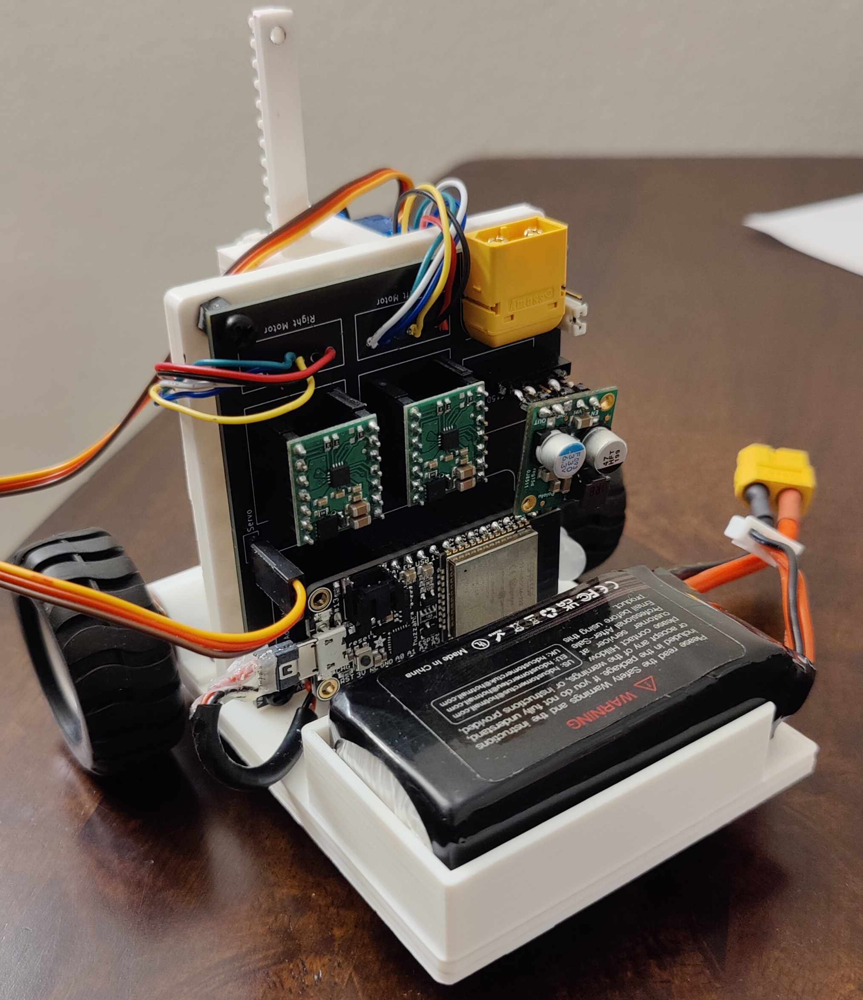
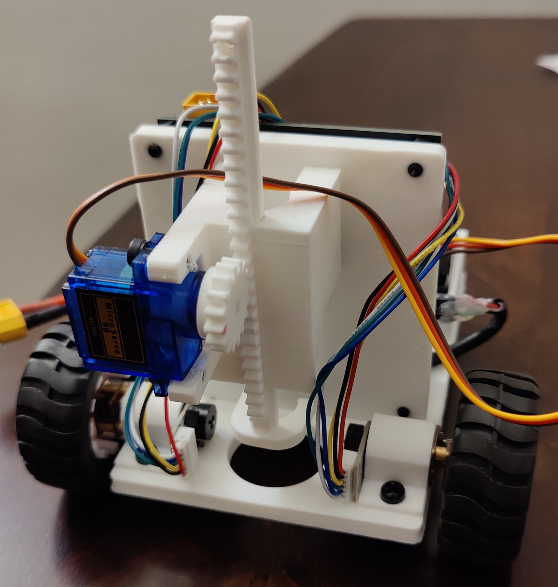
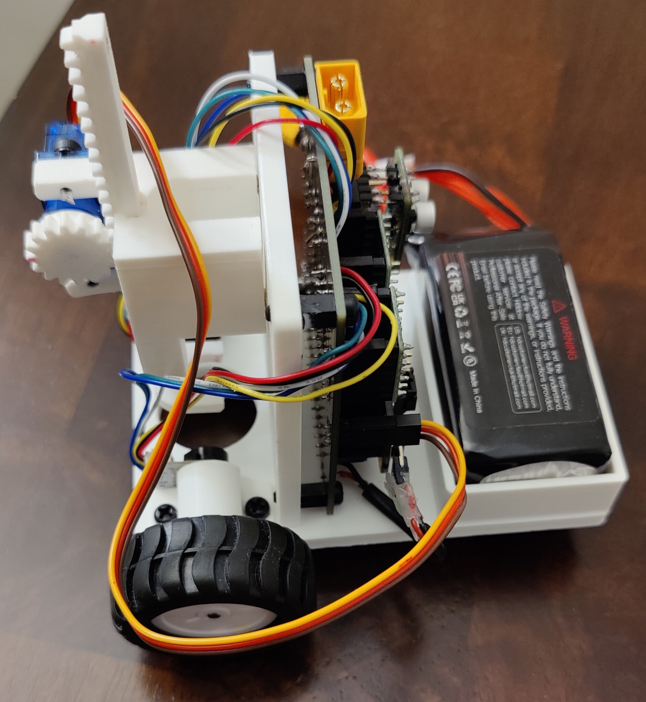

# VanGo: A Drawing Robot
VanGo is a differential drive robot that can draw SVG images on a page.

  
   
  

First, an SVG image is converted to XY coordinates using this online tool: [Coordinator](https://spotify.github.io/coordinator/).
Then, using these XY coordinates, a trajectory of waypoints is generated for the robot to follow.
Trajectory tracking is implemented using a simple PID steering control algorithm, and the robot determines its pose in space
through wheel odometry, using quadrature encoders on the motors. For more in-depth information, please see the VanGo documentation
at [https://nmarks99.github.io/VanGo/](https://nmarks99.github.io/VanGo/). VanGo is still relatively early in development
and several aspects of the project need more work and fine tuning, such as the trajectory tracking algorithm, a command line interface
for the client application, and improved mechanical design. However, in its current state, VanGo demonstrates a good proof of concept.

## Project Structure
- `vango-firmware` is the firmware for the ESP32 board based on [esp-idf-hal](https://github.com/esp-rs/esp-idf-hal)
- `vango-client` is a desktop command line application for controlling the robot
- `vango-utils` is a utility library used by both the firmware and client.
- `hardware` directory contains the KiCAD project for the PCB

## Future Development
This project also uses another library I have developed, [diff-drive](https://github.com/nmarks99/diff-drive),
primarily for pose estimation via wheel odometry. In the future I hope to use both the VanGo and diff-drive projects
as starting points for developing a general purpose, high-performance, and open-source, differential drive robot
that anyone can build with firmware based on Rust on the ESP32 (think DIY [TurtleBot](https://www.robotis.us/turtlebot-3/)).

## Other Notes
One of my biggest motivations for this project was to learn more rust programming, particularly embedded rust, which is why
this project is 100% rust code 🦀. Like mostly everyone else, I've primarily used C and C++ for programming microcontrollers
in the past, most of the time using the Arduino framework together with PlatformIO which I've found to be a very pleasant
experience. After having worked on this project for several months, using Rust on the ESP32, I've found it to be a
equally pleasant experience, after some intial growing pains. Below are some of my opinions on the state of embedded Rust.
Note this is generally with regards to Rust on ESP [(esp-rs)](https://github.com/esp-rs), however some of it applies to embedded
Rust in a broader sense.

**The Good**
- Using `esp-idf-hal` you get to program the ESP32 in Rust (almost) as if you were writing a program on your desktop
This means you get to take full advantage of the Rust standard library and mostly any external crates you may need.
- Using Cargo works the same as it would in your other Rust projects and integrates seamlessly with flashing the board.
you can see in my vango-firmware/.cargo/config.toml file, I created an alias `cargo flash` to flash the board from the
command line and also set the partition table (sets how much space in memory you are reserving for your program):
`flash = "espflash --release --partition-table partitions.csv"`
- As in the case for non-embedded Rust, if the code compiles it almost always just works, which is super nice, especially
for embedded projects where you not only have to build, but also flash the board. I've found that bugs are often very easy
to track down in Rust. The only subtle error I encountered, and it's not even that subtle, is that if you accidentally
enter a loop that is doing nothing but looping, it will probably trigger the watchdog timer and continually reset the board.
There is a way to disable the WDT, but you can also just add a short delay (1ms even is enough) if you are in a loop doing
nothing.

**The Bad**
- Finding example code is (unsurpisingly since Arduino is much more mature) a little difficult compared to Arduino.
For example, I had a very tough time finding an example of how to do some basic things like GPIO interrpts
and timer based interrupts, which I could find examples for very easily in Arduino. However, after figuring it out,
a timer interrupt in `esp-idf-hal` turns out to be almost as easy to use as the popular [IntervalTimer](https://www.pjrc.com/teensy/td_timing_IntervalTimer.html)
in Arduino. Another thing that was very tough to find example code for was bluetooth. Eventually I found [esp32-nimble](https://github.com/taks/esp32-nimble)
which works quite well and isn't too complicated. The developer is was also quick to reply to an issue I opened for an additional feature.
- Flashing the board takes *forever*. I haven't timed it but it probably takes like a minute or two maybe which is much longer than similar Arduino
programs. This may just be something specific to my project, but it was fairly annoying to wait for the board to be flashed whenever I made updates.
