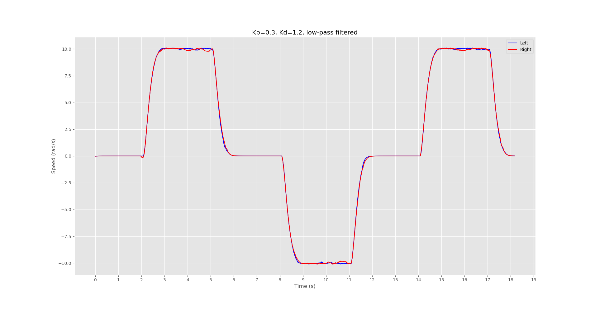

# Control
VanGo's control architecture is comprised of a lower level speed control loop
and a higher level trajectory tracking controller. From a user perspective, the lower level
control loop can mostly be ignored, or at least treated as a black box and not modified, while the
higher level controller may leave more room for customization.

## Low-Level Speed Controller
Running on the ESP32 microcontroller, a timer based interrupt is resposible for reading the
quadrature wheel encoders to compute the speed of the wheels. Experimentally it was determined that
a simply proportional controller was sufficient for closed-loop speed control, although Proportional-Derivative (PD)
control was also tested. Although PD control results is a smoother trajectory with less overshoot, the slower response
was not worth the minimization of overshoot. Either way, both P and PD controllers work fairly well for closed-loop
speed control, and if one is preferred by the user, the gains may be adjusted in the firmware and reflashed to the board.
For more information on editing and flashing firmware, see [Development](./dev.md).

The two images below show the speed controller response for both the Proportional and Proportional-Derivative controllers.

## (TODO: Make sure this ok) High-Level Trajectory Controller
The `vango-client` implements a trajectory tracking algorithm which is used to follow a trajectory defined
by a set of waypoints. During development, there was a choice to be made regarding whether the the trajectory controller
will operate on the client side or the firmware side. Both options have positives and negatives and will be briefly discussed
below.

### Client-Side Trajectory Controller
A client side trajectory controller works by implementing the trajectory tracking algorithm in the `vango-client`
application. The controller will read information about the robot over bluetooth low-energy (BLE) such as the robot's current pose
and wheel speeds, compute the necessary wheel speeds for tracking the desired trajectory, and send those target wheel
speeds back to the robot over BLE.

**Pros**
- Faster development time since you will not need to reflash the microcontroller
- Easier to test different trajectory tracking algorithms or enable several algorithms to be available as options to the user
- Can take advantage of a client machine with higher computing power than the microcontroller

**Cons TODO: CHECK**
- Control loop speed is limited by BLE read/write latency. In it's current state, loop speeds top out around 30Hz.
