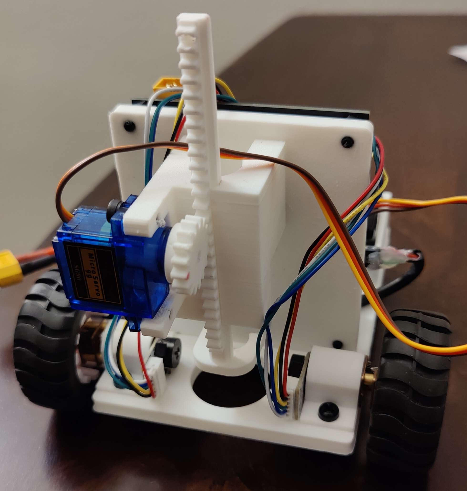

# Overview

  
   
  

VanGo is a differential drive robot for drawing SVG images. Put simply,
VanGo is a wheeled mobile robot capable of trajectory tracking,
with the added feature that the trajectory is generated from an SVG
image and the robot holds a marker which is brought into contact with the
page while the robot is on the desired path, thus drawing the SVG image.

## Usage
A basic explanation of how VanGo is used and what goes on under-the-hood during general use is explained below.
More in-depth explaination can be found is later sections of this site.
1. The user produces a CSV file containing (x,y) points from a SVG image using [Coordinator](spotify.github.io/coordinator)
2. The user starts the `vango-client` program, providing the CSV file
3. A path of waypoints is generated from the CSV file and clustered into closed curves based on some threshold distance
4. The robot will navigate to the first point in the next closed curve
5. Lower the marker, then navigate to each additional point in the same closed curve
6. After passing through all the points in this closed curve, raise the marker and go back to step 4.
