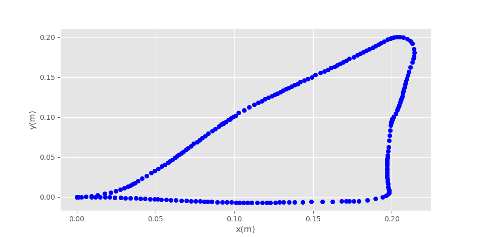

# Performance
In its current stage, the VanGo drawing robot does not work well enough to draw
consistent and accurace images, however with additional tuning, a more sophisticated
trajectory tracking algorithm, and possibly additional sensors, the performance will
improve. Manual mode, which enables a user to manually drive the robot and move
the marker up and down works as desired. Below the results of several tests are shown.

## Test 1: Manual Mode "Hi"
In the video linked below, I manually controlled the robot using the `vango-client`
application to write "Hi". This worked fairly well, but as you can see, driving the robot
smoothly with the current controls is a bit challenging.

[Test 1 Video](https://drive.google.com/file/d/1G3J-nfXMaDWAlqaTBmTTMUwiaXZAd-wS/view?usp=sharing)

## Test 2: Automatic Mode "Triangle"
The video linked below performs a test of the robot in automatically mode
attempting to draw a triangle. There is also a plot of the estimated x and y
position of the robot from wheel odometry. As you can see the actual position
of the robot is not very good, however the position estimate from odometry appears to be
a bit better. This could potentially be due to wheel slipping.

[Test 2 Video](https://drive.google.com/file/d/1G4sDGH2qyjXhTE3TqAN95uGIOtFKYngA/view?usp=drive_link)

